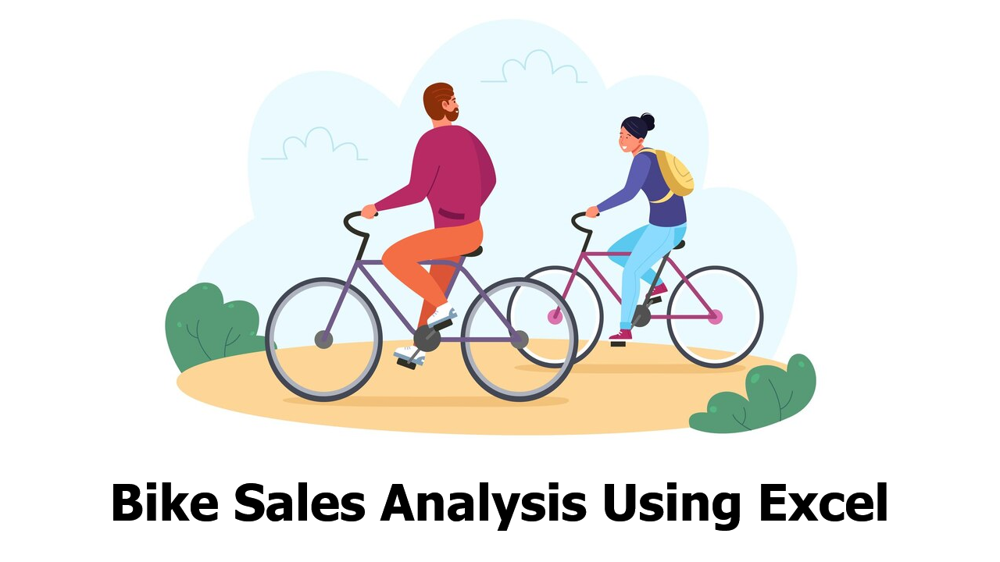
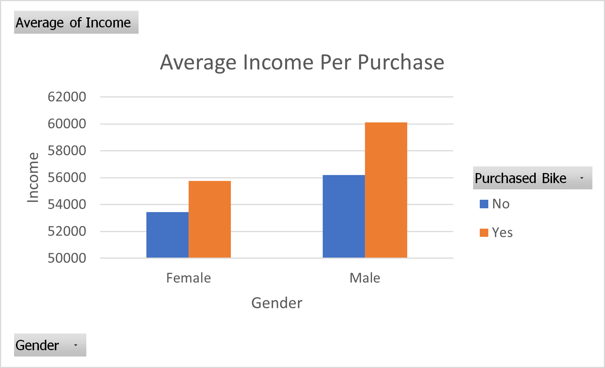
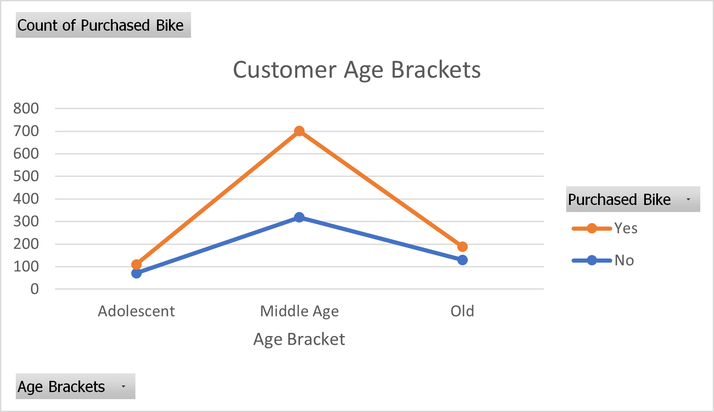
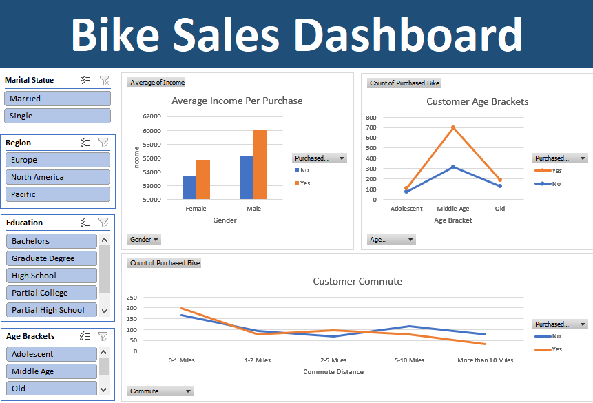

<!-- PROJECT TITLE -->
<h1 align="center">Bike Sales Analysis Using Excel</h1>

<!-- HEADER -->

  

<!-- PROJECT OVERVIEW -->
##  **➲ Project overview**
This project centers around a meticulous analysis of bike sales, leveraging the Bike Buyers Dataset comprising 1000 records with comprehensive features, including Marital Status, Gender, Income, Children, Education, Occupation, Home Ownership, Cars, Commute Distance, Region, Age, and Purchased Bike. The analysis is conducted using Microsoft Excel, showcasing a structured and insightful approach.

<!-- PREREQUISTIES -->
##  **➲ Prerequisites**
This is list of required tools for the project to be installed :
* <a href="https://www.microsoft.com/en-us/download/office" target="_blank">Microsoft Office</a>

<!-- THE DATASET -->
##  **➲ The Dataset**
<a href="https://www.kaggle.com/datasets/heeraldedhia/bike-buyers" target="_blank">The Bike Buyers Dataset</a>  encompasses a rich set of features, offering valuable insights into consumer behavior and preferences related to bike purchases. 
**Features:** 
- ID: Unique identifier for each record.  
- Marital Status: Relationship status of the buyer ('Single' or 'Married').    
- Gender: Gender of the buyer ('Male' or 'Female').   
- Income: Financial income of the buyer.  
- Children: Number of children in the buyer's household.  
- Education: Educational background of the buyer.  
- Occupation: Professional occupation of the buyer.  
- Home Owner: Ownership status of the buyer's residence.  
- Cars: Number of cars owned by the buyer.  
- Commute Distance: Distance of the buyer's commute.  
- Region: Geographic region of the buyer.  
- Age: Age of the buyer.  
- Purchased Bike: Binary indicator of bike purchase ('Yes' or 'No').

<!-- DATA CLEANING -->
##  **➲ Data Cleaning**
The dataset undergoes meticulous cleaning through the following procedures:
* Reformulation of the Marital Status column: Substituting 'S' with 'Single' and 'M' with 'Married'.
* Refinement of the Gender column: Transformation of 'F' to 'Female' and 'M' to 'Male'.
* Introduction of the 'Age Brackets' column via a nested IF formula based on age conditions.

<!-- DATA ANALYSIS -->
##  **➲ Data Analysis**
In this part we create 3 pivot tables to get useful insights and then use these tables to create a dynamic dashboard where we analyze the following :  
* Average Income Per Purchase
Table 1 demonstrates the average income per gender juxtaposed with the number of purchases.

* Customer Commute
Table 2 delineates the correlation between commute distance and the number of purchases.

* Customer Age Brackets
Table 3 elucidates the distribution of purchases across distinct age brackets.

* Dashboard
The project encompasses a dynamic dashboard, harmonizing the three pivot tables and integrating slicers for seamless data filtering.

<!-- CONCLUSION -->
##  **➲ Conclusion**
In conclusion, the comprehensive analysis of bike sales using Excel has unearthed valuable insights into the purchasing behavior of customers. The project has highlighted the significance of factors such as income, commute distance, and age in influencing bike purchase decisions. The provided pivot tables and dashboard offer a user-friendly interface to explore these insights dynamically.

This analysis serves as a foundation for strategic decision-making in marketing, inventory management, and product development within the context of bike sales. The dataset, thoroughly cleaned and analyzed, provides a robust basis for future research and actionable business intelligence.

Feel free to explore the associated Excel file to delve deeper into the nuanced analysis and visualizations.

<!-- CONTACT -->
##  **➲ Contact**
- E-mail   : [omaarelsherif@gmail.com](mailto:omaarelsherif@gmail.com)
- LinkedIn : https://www.linkedin.com/in/omaarelsherif/
- Facebook : https://www.facebook.com/omaarelshereif
